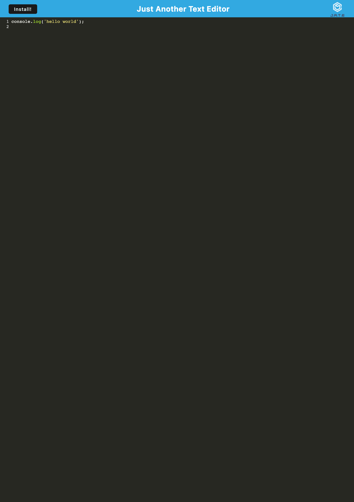

# Just Another Text Editor

## Description
This Progressive Web Application was created to be able to write notes and code snippets with or without an internet connection.

## Installation
This application makes use of Express and Webpack. To get started, open the folder and run `npm i` to install the necessary dependencies. From there, run `npm run start` to spin up the server and start the application.

## Usage
This app runs like a text editor in your browser and can be downloaded to be used without an internet connection. To download JATE, just click the install button on the top left of the screen and it will install directly onto your own machine.

A screenshot of the app can be found below, and you can find the application at https://vert-saucisson-83353-e3183b87f1a2.herokuapp.com/

## License
Please refer to the LICENSE in the repo.
